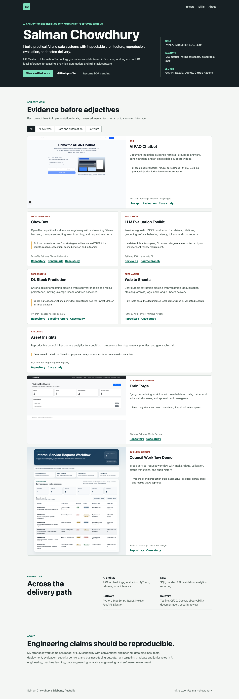

# Salman Chowdhury — AI & Data Engineering Portfolio

A lightweight recruiter-facing portfolio site presenting selected AI, data, automation and software projects as one coherent engineering narrative.



[Architecture, trade-offs, validation, and limitations](docs/case-study.md)

## Features

- Responsive single-page design
- Project filters for AI systems, data/automation and software
- Recruiter snapshot and technical-capability sections
- Direct links to flagship repositories
- Direct links to case studies and measured benchmark reports
- Actual AI FAQ, TrainForge and council workflow screenshots
- GitHub Pages deployment workflow
- Pull-request validation for required assets and project links

## Local preview

Open `index.html` directly or serve the directory:

```bash
python -m http.server 8000
```

Then visit `http://localhost:8000`.

## Validation

```bash
node scripts/check-site.mjs
```

The July 2026 Playwright audit covered 1440 x 1000, 390 x 844, and 320 x 700 viewports. It found no horizontal overflow, broken images, unnamed controls, console errors, or filter-state failures, and confirmed that the project section remains visible in the first viewport.

## Deployment

GitHub Pages deploys the site from `main` through the repository's Actions workflow:

https://salman-chowdhury.github.io/portfolio/
