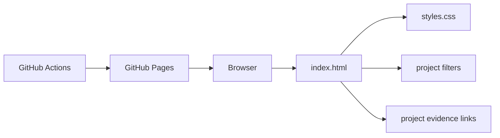

# Portfolio Case Study

## Problem and solution

Recruiters need a fast path from a broad skills list to inspectable project evidence. This static site groups selected AI, data, automation, and software work and links directly to repositories, case studies, and measured results.

## Architecture



## Trade-offs

- Static hosting keeps deployment and maintenance small but provides no server-side contact form.
- Evidence links are explicit and reviewable, but they require periodic link checking.
- Project filtering improves scanning without adding a frontend framework.

## Measured validation

- GitHub Pages deployment run `29161739698` passed validation and deployment.
- The live URL returned HTTP 200 during the July 2026 audit.
- Playwright captured desktop (1440 x 1000) and mobile (390 x 844) screenshots from the actual site.
- Responsive checks at 1440 x 1000, 390 x 844, and 320 x 700 found no horizontal overflow, broken images, unnamed controls, console errors, or project-filter failures.
- Recruiter evidence links include the 8-case AI FAQ evaluation, 24-request ChowBox benchmark, 2025 rolling forecasting baselines, and seven implementation case studies.

## Limitations and failure modes

- External repository links can move or become private.
- The site has no analytics or form backend.
- Claims can become stale unless benchmark reports and screenshots are regenerated.
- No resume, LinkedIn URL, or public contact address was found during the audit; the site shows only verified GitHub contact information and an explicit resume placeholder.

## Reproduce

```bash
python -m http.server 8000
# Open http://127.0.0.1:8000
node scripts/check-site.mjs
```
