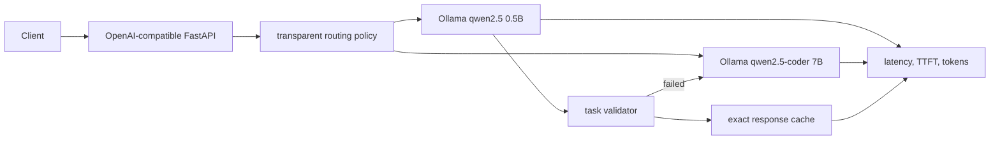

# ChowBox Public Evidence

ChowBox is a private implementation repository. This public summary contains no model weights, credentials, private prompts, or private source code.

## Architecture

## Measured local benchmark

Run on macOS 15.6.1 arm64 with Ollama 0.15.5. The v1 dataset contains factual, executable coding, long-context, privacy-sensitive, and repeated cacheable requests. Each strategy processed six requests because the cacheable task was repeated.

| Strategy | Pass rate | p50 latency ms | p95 latency ms | TTFT p50 ms | Prompt tokens | Completion tokens | Cache hits | Escalations |
|---|---:|---:|---:|---:|---:|---:|---:|---:|
| Fixed small | 0.67 | 132.97 | 824.19 | 71.69 | 2710 | 36 | 0 | 0 |
| Fixed large | 1.00 | 426.23 | 10019.36 | 235.33 | 2710 | 36 | 0 | 0 |
| Simple rule router | 0.67 | 106.31 | 10189.43 | 94.41 | 2710 | 36 | 0 | 0 |
| ChowBox policy | 1.00 | 375.45 | 10791.51 | 229.16 | 2710 | 36 | 1 | 2 |

The ChowBox policy matched the fixed-large task pass rate in this small run through two escalations and one exact-cache hit. This is not a general quality claim.

## Validation and limits

- Seven unit/API/backend tests passed, including a mocked streaming Ollama response and exact-cache test.
- A live local FastAPI request selected the 0.5B model, recorded real token counts and TTFT, and the repeated request returned a cache hit with zero model token work.
- Coding success required generated `add(a, b)` code to pass three isolated executable assertions after a strict AST allowlist.
- Energy, peak memory, hardware power, monetary cost, and confidence intervals were not measured and are not inferred.
- The exact cache is process-local, and the routing policy is rule-based rather than learned.
