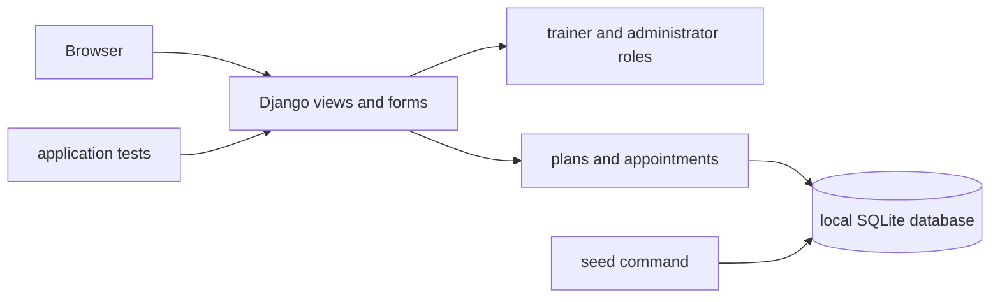

# TrainForge Public Evidence

TrainForge is a private implementation repository. This public summary contains no credentials, private source code, or user data.

## Problem and architecture

TrainForge demonstrates a trainer appointment workflow with role-aware dashboards, seeded local demo data, appointment management, and administrative views.

## Measured validation

- Fresh migrations completed against a new local database.
- The seed command created demo users and workflow records without printing passwords.
- Seven application tests passed in 1.48 seconds during the July 2026 audit.
- The dashboard and appointment pages were run locally and captured from the actual application.

## Trade-offs and limits

- SQLite and local seeded data make review simple but are not a multi-instance production deployment.
- Demo credentials are supplied through environment variables; they are not embedded in screenshots or console output.
- The current evidence validates workflow execution and tests, not production load, availability, or security certification.
